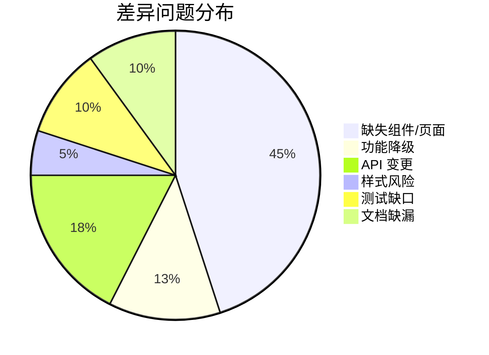
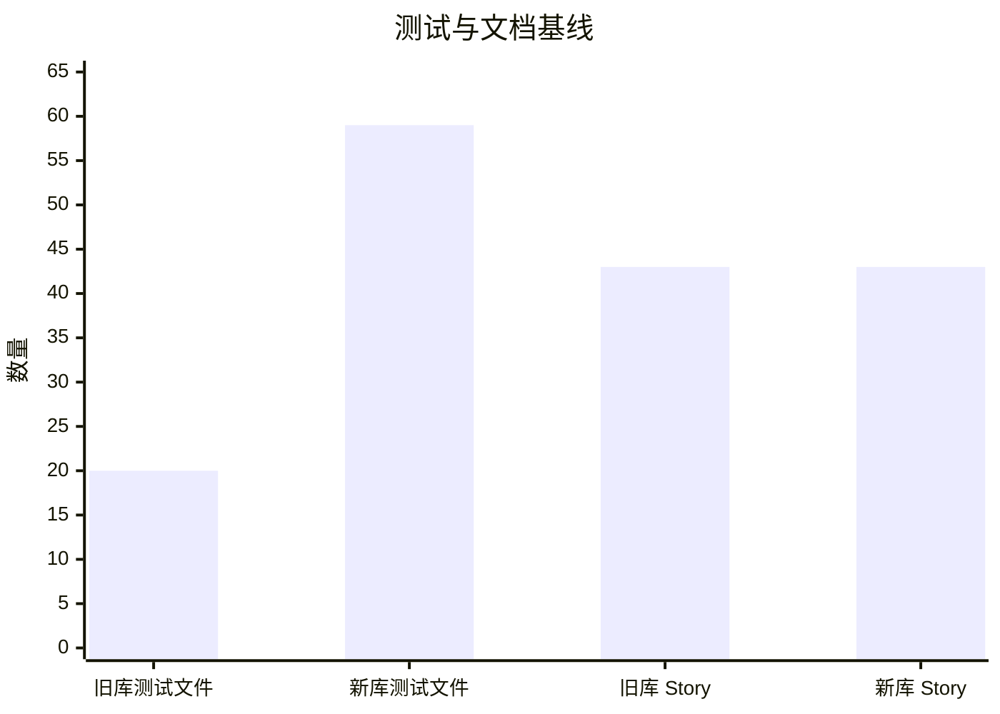

# mp-react vs mp-react18 全量组件差异审计

## 1. 审计范围

- 对比仓库：
  - `mp-react-components`（旧库 / 原始版本）
  - `mp-react18-components`（React 18 重构版本）
- 对比对象：
  - `src/index.ts` 公开导出
  - `src/components/**` 组件实现
  - `src/pages/**` 页面级示例/组合容器
  - `src/stories/**` Storybook 文档
  - `README*` 与 `docs/**` 迁移文档
- 重点维度：
  - 组件名称
  - 文件路径
  - props / 导出合同
  - 状态管理
  - 生命周期 / effect 结构
  - 样式依赖
  - 单元测试与 Story 覆盖
  - 国际化支持
  - 无障碍语义
  - 性能优化

## 2. 审计结论摘要

- `mp-react18-components` 不是“原仓库逐文件平移”，而是“公开组件面大体补齐 + 内部实现重构”。
- 真正高风险并非 `navigation` / `publications`，而是 `periodic-table`、`crystal-toolkit`、旧根导出兼容层以及页面级组合能力的去留。
- 旧仓库公开导出约 `57` 个符号；新仓库入口导出项约 `65` 个，且新增了 `ActiveFilterButtons`、`ArrayChips`、`ButtonBar`、`CheckboxList`、`TextInput`、`ThreeStateBooleanSelect` 等公开入口。
- Storybook 条目数两边均为 `43`，但测试基线差异明显：
  - 旧库组件测试文件约 `20`
  - 新库组件测试文件约 `59`
- 当前工程健康度：
  - `mp-react18-components`：`npm test` 通过（`59` 文件 / `139` 用例），`npm run build` 通过
  - `mp-react18-components`：`npm run typecheck` 初始失败于 Storybook 旧导入，已修复
  - `mp-react-components`：`npm test -- --runInBand` 因 `type: "module"` 与 `jest.config.js` CommonJS 用法冲突，当前无法作为可靠回归基线

## 3. 差异分布图

## 4. 统一组件清单

说明：

- `状态` 取值：
  - `一致`：React 18 版存在且无明显破坏性缺口
  - `重构`：React 18 版存在，但内部状态/依赖/行为有明显变化
  - `缺失`：旧库有该能力，新库未提供等价公开入口
  - `新增`：React 18 版新增公开组件
- `i18n`：两仓库源码内均未发现 `react-intl` / `i18n` / `useTranslation` 等抽象，统一记为 `无内建框架`

### 4.1 Data Display

| 组件 | 旧路径 | 新路径 | 状态 | 关键差异 |
| --- | --- | --- | --- | --- |
| `ActiveFilterButtons` | `src/components/data-display/ActiveFilterButtons` | `src/components/data-display/ActiveFilterButtons` | 新增 | 旧库目录存在但未顶层导出；新库公开导出并补测试 |
| `ArrayChips` | `src/components/data-display/ArrayChips` | `src/components/data-display/ArrayChips` | 新增 | 同上，新增公开入口与测试 |
| `ButtonBar` | `src/components/data-display/ButtonBar` | `src/components/data-display/ButtonBar` | 新增 | 同上 |
| `DataBlock` | `src/components/data-display/DataBlock` | `src/components/data-display/DataBlock` | 一致 | 新库补测试，使用更现代 TS/React 18 写法 |
| `DataCard` | `src/components/data-display/DataCard` | `src/components/data-display/DataCard` | 新增 | 旧库组件存在但未顶层导出；新库公开导出 |
| `Paginator` | `src/components/data-display/Paginator` | `src/components/data-display/Paginator` | 新增 | 旧库内部可用但未顶层导出；新库公开导出并补测试 |
| `Enlargeable` | `src/components/data-display/Enlargeable` | `src/components/data-display/Enlargeable` | 一致 | 新库补测试 |
| `JsonView` | `src/components/data-display/JsonView` | `src/components/data-display/JsonView` | 重构 | 底层依赖从 `react-json-view` 改为 `@microlink/react-json-view`，编辑回调仍为 no-op |
| `SortDropdown` | `src/components/data-display/SortDropdown` | `src/components/data-display/SortDropdown` | 新增 | 旧库仅目录存在，新库公开导出并补测试 |
| `DataTable` | `src/components/data-display/DataTable` | `src/components/data-display/DataTable` | 重构 | 底层从 `react-data-table-component` 切到 `@tanstack/react-table`，公开 props 主要保留 |
| `DownloadButton` | `src/components/data-display/DownloadButton` | `src/components/data-display/DownloadButton` | 一致 | 新库补测试 |
| `DownloadDropdown` | `src/components/data-display/DownloadDropdown` | `src/components/data-display/DownloadDropdown` | 一致 | 新库补测试，交互底层已重写 |
| `Drawer` | `src/components/data-display/Drawer` | `src/components/data-display/Drawer` | 重构 | 新库保留 `Drawer` / `DrawerContextProvider` / `DrawerTrigger`，上下文与实现重写 |
| `Formula` | `src/components/data-display/Formula` | `src/components/data-display/Formula` | 一致 | 新库补测试 |
| `Markdown` | `src/components/data-display/Markdown` | `src/components/data-display/Markdown` | 一致 | 依赖链升级，公开面稳定 |
| `Modal` | `src/components/data-display/Modal` | `src/components/data-display/Modal` | 重构 | 新库保留 `Modal` / `ModalContextProvider` / `ModalTrigger`，内部实现与测试体系重写 |
| `SynthesisRecipeCard` | `src/components/data-display/SynthesisRecipeCard` | `src/components/data-display/SynthesisRecipeCard` | 一致 | 新库补测试 |
| `Tooltip` | `src/components/data-display/Tooltip` | `src/components/data-display/Tooltip` | 重构 | 旧 `react-tooltip` 语义转为新实现，主要兼容项已补回但非逐项等价 |
| `SearchUIContainer` | `src/components/data-display/SearchUI/SearchUIContainer` | `src/components/data-display/SearchUI/SearchUIContainer` | 重构 | 保留主装配入口，Context 实现与数据流重构 |
| `SearchUIContextProvider` | `src/components/data-display/SearchUI/SearchUIContextProvider` | `src/components/data-display/SearchUI/SearchUIContextProvider` | 新增 | 旧库目录存在但未顶层导出，新库显式公开 |
| `SearchUIDataCards` | `src/components/data-display/SearchUI/SearchUIDataCards` | `src/components/data-display/SearchUI/SearchUIDataCards` | 新增 | 新库显式公开，并作为 cards 视图兼容层 |
| `SearchUIDataHeader` | `src/components/data-display/SearchUI/SearchUIDataHeader` | `src/components/data-display/SearchUI/SearchUIDataHeader` | 一致 | 新库补部分测试与 a11y 属性 |
| `SearchUIDataTable` | `src/components/data-display/SearchUI/SearchUIDataTable` | `src/components/data-display/SearchUI/SearchUIDataTable` | 重构 | 受 `DataTable` 重构影响最大 |
| `SearchUIDataView` | `src/components/data-display/SearchUI/SearchUIDataView` | `src/components/data-display/SearchUI/SearchUIDataView` | 一致 | 新库补测试 |
| `SearchUIGrid` | `src/components/data-display/SearchUI/SearchUIGrid` | `src/components/data-display/SearchUI/SearchUIGrid` | 一致 | 新库补测试 |
| `SearchUIFilters` | `src/components/data-display/SearchUI/SearchUIFilters` | `src/components/data-display/SearchUI/SearchUIFilters` | 一致 | 新库补测试 |
| `SearchUISearchBar` | `src/components/data-display/SearchUI/SearchUISearchBar` | `src/components/data-display/SearchUI/SearchUISearchBar` | 重构 | 旧兼容 props 已补回，但内部状态模型已变化 |
| `SearchUISynthesisRecipeCards` | `src/components/data-display/SearchUI/SearchUISynthesisRecipeCards` | `src/components/data-display/SearchUI/SearchUISynthesisRecipeCards` | 新增 | 新库公开导出 |

### 4.2 Data Entry

| 组件 | 旧路径 | 新路径 | 状态 | 关键差异 |
| --- | --- | --- | --- | --- |
| `CheckboxList` | `src/components/data-entry/CheckboxList` | `src/components/data-entry/CheckboxList` | 新增 | 旧库目录存在但未顶层导出 |
| `DualRangeSlider` | `src/components/data-entry/DualRangeSlider` | `src/components/data-entry/DualRangeSlider` | 一致 | 新库补样式与测试 |
| `FilterField` | `src/components/data-entry/FilterField` | `src/components/data-entry/FilterField` | 一致 | 新库保留 SearchUI 适配职责 |
| `GlobalSearchBar` | `src/components/data-entry/GlobalSearchBar` | `src/components/data-entry/GlobalSearchBar` | 一致 | 仍是 `MaterialsInput` 的薄封装 |
| `MaterialsInput` | `src/components/data-entry/MaterialsInput` | `src/components/data-entry/MaterialsInput` | 重构 | 输入类型切换、周期表联动、帮助文案和 autocomplete 流重写 |
| `RangeSlider` | `src/components/data-entry/RangeSlider` | `src/components/data-entry/RangeSlider` | 一致 | 新库补测试 |
| `Select` | `src/components/data-entry/Select` | `src/components/data-entry/Select` | 一致 | 实现重写，公开 props 大体稳定 |
| `Switch` | `src/components/data-entry/Switch` | `src/components/data-entry/Switch` | 一致 | 新库增加 a11y 属性与测试 |
| `TextInput` | `src/components/data-entry/TextInput` | `src/components/data-entry/TextInput` | 新增 | 旧库目录存在但未顶层导出 |
| `ThreeStateBooleanSelect` | `src/components/data-entry/ThreeStateBooleanSelect` | `src/components/data-entry/ThreeStateBooleanSelect` | 新增 | 旧库目录存在但未顶层导出 |

### 4.3 Navigation

| 组件 | 旧路径 | 新路径 | 状态 | 关键差异 |
| --- | --- | --- | --- | --- |
| `Dropdown` | `src/components/navigation/Dropdown` | `src/components/navigation/Dropdown` | 一致 | 内部菜单实现重写 |
| `Link` | `src/components/navigation/Link` | `src/components/navigation/Link` | 一致 | 新库补测试 |
| `Navbar` | `src/components/navigation/Navbar` | `src/components/navigation/Navbar` | 一致 | 新库拆出 `types.ts` 并补测试 |
| `NavbarDropdown` | `src/components/navigation/NavbarDropdown` | `src/components/navigation/NavbarDropdown` | 一致 | 新库补测试 |
| `NotificationDropdown` | `src/components/navigation/NotificationDropdown` | `src/components/navigation/NotificationDropdown` | 一致 | 新库补样式文件和测试，`Bell` 仍随 barrel 导出 |
| `Scrollspy` | `src/components/navigation/Scrollspy` | `src/components/navigation/Scrollspy` | 一致 | 新库补测试 |
| `Sidebar` | `src/components/navigation/Sidebar` | `src/components/navigation/Sidebar` | 重构 | 样式从 `.less` 调整为 `.css`，实现与测试体系重写 |
| `Tabs` | `src/components/navigation/Tabs` | `src/components/navigation/Tabs` | 重构 | 交互底层重写，a11y 明显优于旧版 |

### 4.4 Periodic Table

| 组件 | 旧路径 | 新路径 | 状态 | 关键差异 |
| --- | --- | --- | --- | --- |
| `SelectableTable` | `src/components/periodic-table/table-state.tsx` | `src/components/periodic-table/SelectableTable/SelectableTable.tsx` | 重构 | 旧 store/RxJS 风格切到 Context + selection-state/view-model；`onStateChange` 合同变化 |
| `TableFilter` | `src/components/periodic-table/periodic-filter/table-filter.tsx` | `src/components/periodic-table/TableFilter/TableFilter.tsx` | 重构 | 过滤合同基本补齐，但内部联动模型已改写 |
| `StandalonePeriodicComponent` | `src/components/periodic-table/periodic-element/standalone-periodic-component.tsx` | `src/components/periodic-table/StandalonePeriodicComponent/StandalonePeriodicComponent.tsx` | 重构 | 新库作为独立公开组件，复用 `SelectableTable` 样式层 |
| `PeriodicTableModeSwitcher` | `src/components/periodic-table/PeriodicTableModeSwitcher` | `src/components/periodic-table/PeriodicTableModeSwitcher` | 新增 | 旧库目录存在但未顶层导出 |
| `PeriodicTableFormulaButtons` | `src/components/periodic-table/PeriodicTableFormulaButtons` | `src/components/periodic-table/PeriodicTableFormulaButtons` | 新增 | 旧库目录存在但未顶层导出 |
| `PeriodicTablePluginWrapper` | `src/components/periodic-table/PeriodicTablePluginWrapper` | `src/components/periodic-table/PeriodicTablePluginWrapper` | 新增 | 新库作为插件槽位兼容层公开导出 |
| `PeriodicContext` | `src/components/periodic-table/periodic-table-state/periodic-selection-context.tsx` | `src/components/periodic-table/SelectableTable/PeriodicSelectionContext.tsx` | 缺失 | 新库文件内仍存在 `PeriodicContext`，但未从包根导出 |

### 4.5 Publications

| 组件 | 旧路径 | 新路径 | 状态 | 关键差异 |
| --- | --- | --- | --- | --- |
| `BibCard` | `src/components/publications/BibCard` | `src/components/publications/BibCard` | 一致 | 新库补测试，HTML 标题兼容已回归 |
| `BibFilter` | `src/components/publications/BibFilter` | `src/components/publications/BibFilter` | 一致 | 新库补测试与排序菜单重写 |
| `BibjsonCard` | `src/components/publications/BibjsonCard` | `src/components/publications/BibjsonCard` | 一致 | 新库补测试 |
| `BibtexButton` | `src/components/publications/BibtexButton` | `src/components/publications/BibtexButton` | 一致 | 新库补测试 |
| `CrossrefCard` | `src/components/publications/CrossrefCard` | `src/components/publications/CrossrefCard` | 一致 | 新库补测试 |
| `OpenAccessButton` | `src/components/publications/OpenAccessButton` | `src/components/publications/OpenAccessButton` | 一致 | 新库补测试 |
| `PublicationButton` | `src/components/publications/PublicationButton` | `src/components/publications/PublicationButton` | 一致 | bibliography tooltip 的兼容行为已补回 |

### 4.6 Crystal Toolkit

| 组件 | 旧路径 | 新路径 | 状态 | 关键差异 |
| --- | --- | --- | --- | --- |
| `CameraContextProvider` | `src/components/crystal-toolkit/CameraContextProvider` | `src/components/crystal-toolkit/CameraContextProvider` | 一致 | 新库补测试并收紧类型 |
| `CrystalToolkitScene` | `src/components/crystal-toolkit/CrystalToolkitScene` | `src/components/crystal-toolkit/CrystalToolkitScene` | 重构 | 保留入口，但运行时与副作用处理有较多 React 18 调整 |
| `CrystalToolkitAnimationScene` | `src/components/crystal-toolkit/CrystalToolkitAnimationScene` | `src/components/crystal-toolkit/CrystalToolkitAnimationScene` | 重构 | 同上 |
| `Download` | `src/components/crystal-toolkit/Download` | `src/components/crystal-toolkit/Download` | 一致 | 新库补测试 |
| `PhononAnimationScene` | `src/components/crystal-toolkit/PhononAnimationScene` | `src/components/crystal-toolkit/PhononAnimationScene` | 重构 | 同上 |
| `ReactGraphComponent` | `src/components/crystal-toolkit/graph.component.tsx` | `src/components/crystal-toolkit/ReactGraphComponent/ReactGraphComponent.tsx` | 一致 | 路径规范化并补测试 |
| `Scene` | `src/components/crystal-toolkit/scene/Scene.ts` | `src/components/crystal-toolkit/scene/Scene.ts` | 缺失 | 新库保留 runtime 文件，但未从包根导出 |
| `DynamicCrystalToolkitScene` | `src/components/crystal-toolkit/DynamicCrystalToolkitScene/DynamicCrystalToolkitScene.tsx` | 无 | 缺失 | 旧库内部组件，新库文档明确暂不迁移 |

### 4.7 页面级组合容器

新库已移除 `src/pages/**`，以下页面级能力在 React 18 仓库中无等价目录：

- `BatteryExplorer`
- `CatalystExplorer`
- `CrystalStructureAnimationViewer`
- `CrystalStructureViewer`
- `MPContribsSearch`
- `MaterialsDetail`
- `MaterialsExplorer`
- `MatscholarMaterialsExplorer`
- `MofExplorer`
- `MoleculesExplorer`
- `PhononAnimationViewer`
- `Publications`
- `Sandbox`
- `SynthesisExplorer`
- `XasApp`

结论：

- 若 `mp-react18-components` 的目标仅为“可发布组件库”，这些页面可视为刻意裁剪。
- 若目标包含“完整替代旧仓库作为开发/示例/回归容器”，则这是明确缺口。

## 5. 维度差异总结

### 5.1 Props / API

- 高风险 API 变化集中在：
  - `SelectableTable`
  - `SearchUI` 相关类型导出
  - `DataTable`
  - `Tooltip`
  - `JsonView`
- 典型变化：
  - `SelectableTable.onStateChange` 从 `string[]` 扩展为联合结构
  - 新增 `onTableStateChange`
  - 新增 `detailedElement` / `onDetailedElementChange`
  - `Scene`、`PeriodicContext` 不再作为根导出

### 5.2 状态管理

- 旧库复杂区块更多依赖：
  - 组件内部 `useState`
  - `react-data-table-component` 内部状态
  - 周期表 `table-store` / Rx 风格状态流
- 新库复杂区块更多依赖：
  - React Context
  - `@tanstack/react-table`
  - `useMemo` / `useCallback`
  - 拆分的 `selection-state.ts`、`view-model.ts`

### 5.3 生命周期 / Effect

- 旧库 effect 使用更松散，部分组件依赖老式第三方库内部状态。
- 新库在 `SelectableTable`、`DataTable`、`SearchUI` 等区域增加了同步 effect。
- `CrystalToolkitScene` / `CrystalToolkitAnimationScene` / `PhononAnimationScene` 仍存在明显的 effect 频次和渲染次数风险注释。

### 5.4 样式依赖

- 两边都依赖 `Bulma` 与组件级 `CSS/Less`。
- 新库周期表区域仍大量依赖全局类名 `.mat-element` 以及 Less 组合，属于最容易在宿主打包场景中出现样式漂移的区域。
- `Sidebar` 样式从 `.less` 调整为 `.css`，需要重点做视觉回归。

### 5.5 测试覆盖

- 新库测试文件数量显著高于旧库，但当前没有覆盖率报表，无法证明“单元测试 ≥90%”。
- 旧库测试基线已经失效，无法直接作为对照回归基准。
- 新库当前缺少：
  - 覆盖率阈值
  - 集成测试计数约束
  - 性能基准脚本

### 5.6 国际化

- 两仓库均未检测到标准化 i18n 框架接入。
- 当前国际化基本依赖 props 文案透传，不具备统一词条管理、语言切换或格式化体系。

### 5.7 无障碍

- 新库明显优于旧库：
  - 更多 `aria-*` / `role` / `tabIndex` 语义
  - `DataTable` 单选列补了 `aria-label`
  - `Tabs` / `Switch` / `Select` 采用更现代的语义结构
- 旧库大量组件依赖视觉 class 与第三方库默认行为，显式 a11y 辅助较弱。

### 5.8 性能优化

- 新库显著增加了 `useMemo` / `useCallback` 使用，尤其在：
  - `SelectableTable`
  - `PeriodicSelectionContext`
  - `SearchUIContextProvider`
  - `DataTable`
- 但 `crystal-toolkit` runtime 仍有高风险热点，尚不能宣称性能完全收敛。

## 6. 六大类差异报告

### 6.1 缺失组件

- 根导出缺失：
  - `Scene`
  - `PeriodicContext`
- 内部/辅助组件未迁移：
  - `DynamicCrystalToolkitScene`
- 页面级组合容器缺失：
  - `src/pages/**` 全量移除（15 个页面）

### 6.2 功能降级

- `SelectableTable.showSwitcher` 未恢复
- `SelectableTable` 的旧 slot bookkeeping / 多输入选择内部语义未完整恢复
- `JsonView` 编辑相关回调仍为 no-op
- `Tooltip` 已做主要兼容，但并非旧 `react-tooltip` 的逐项等价实现
- `crystal-toolkit` 旧 `DAE / Collada` 导出能力未承诺恢复

### 6.3 API 变更

- `SelectableTable.onStateChange`
- `SelectableTable` 新增 `onTableStateChange`
- `SelectableTable` 新增 `detailedElement` / `onDetailedElementChange`
- `DataTable` 底层实现迁移为 `@tanstack/react-table`
- `SearchUI` 类型与 view map 改为显式导出
- 新库 `peerDependencies` 当前只声明 React 18，未覆盖 React 19

### 6.4 样式丢失 / 样式风险

- 周期表使用全局类 `.mat-element` + Less 导入链，宿主打包时最容易出现视觉漂移
- `Sidebar` / `NotificationDropdown` / `TableFilter` 等样式重写过的模块需做 Storybook 对照截图回归

### 6.5 测试缺失

- 无覆盖率门禁，无法证明 `>=90%` 单测覆盖率
- 无独立集成测试统计口径，无法证明 `>=20` 个集成用例
- 无性能基线脚本，无法证明 `<=5%` 性能衰退
- 旧库测试已因 ESM/Jest 配置冲突失效

### 6.6 文档缺漏

- `docs/full-migration-consistency-plan.md` 仍把若干已迁移模块写成“未迁移”
- `README.md` 中仍有旧包名/旧发布语境残留
- `README.md` / `README.zh-CN.md` 未系统说明页面级能力被移除
- 需要单独的“旧根导出变更清单”与“兼容 shim 迁移指南”

## 7. 必要但未迁移能力优先级评估

缺少真实业务活跃度数据，因此本次优先级使用代理指标：

- 业务影响面：是否为公开导出、是否被 Storybook/README/Smoke 使用
- 用户活跃度代理：是否出现在旧根导出、旧页面、核心故事和 Search/PeriodicTable 主链路中
- 回归风险：是否涉及状态模型、样式系统、3D runtime、宿主导入路径

| 优先级 | 功能 | 业务影响 | 活跃度代理 | 回归风险 | 结论 |
| --- | --- | --- | --- | --- | --- |
| P0 | 恢复或正式废弃 `PeriodicContext` 根导出 | 高 | 高 | 高 | 必须给出兼容结论 |
| P0 | `SelectableTable` 旧语义补齐或明确降级文档 | 高 | 高 | 高 | 必须优先 |
| P0 | 恢复或正式废弃 `Scene` 根导出 | 高 | 中 | 高 | 必须给出包级结论 |
| P0 | `DynamicCrystalToolkitScene` 去留说明 | 中 | 中 | 高 | 至少给出废弃策略 |
| P1 | 页面级容器的迁移/归档策略 | 中 | 中 | 中 | 影响回归和示例链路 |
| P1 | React 19 peer 支持策略 | 高 | 中 | 中 | 影响宿主安装契约 |
| P1 | 周期表样式宿主一致性回归 | 高 | 高 | 中 | 需补截图/Smoke |
| P2 | 文档与 README 清理 | 中 | 高 | 低 | 可并行推进 |

## 8. 补充迁移计划

### 8.1 Workstream A：周期表兼容层

- 目标：
  - 明确 `PeriodicContext` 是否恢复为根导出
  - 收口 `SelectableTable` 的旧合同与降级项
- 工作量估算：
  - `2-3` 人日
- 依赖：
  - `SelectableTable`
  - `PeriodicSelectionContext`
  - `TableFilter`
  - `MaterialsInput`
- 兼容性方案：
  - 先加 export shim，再补行为
  - 无法恢复的语义必须写入迁移指南
- 回滚策略：
  - export shim 独立提交
  - 保留旧合同分支与 smoke 场景

### 8.2 Workstream B：Crystal Toolkit 公开面

- 目标：
  - 明确 `Scene` 与 `DynamicCrystalToolkitScene` 的保留/废弃策略
  - 对 `renderScene` 频次问题补回归用例
- 工作量估算：
  - `3-5` 人日
- 依赖：
  - `three`
  - scene runtime
  - 现有 smoke 测试
- 兼容性方案：
  - 如不恢复公开导出，则增加 deprecated 文档与替代方案
- 回滚策略：
  - 单独版本发布
  - 保留旧导出兼容 tag

### 8.3 Workstream C：页面级能力取舍

- 目标：
  - 明确 `src/pages/**` 是迁移目标还是历史 demo
- 工作量估算：
  - 若只做文档归档：`0.5-1` 人日
  - 若迁移为 `examples/` 或 `react18-smoke`：`3-6` 人日
- 依赖：
  - SearchUI
  - PeriodicTable
  - Crystal Toolkit
- 兼容性方案：
  - 优先迁移高价值页面为 examples，而不是恢复整套旧目录
- 回滚策略：
  - examples 独立目录，不影响库主入口

### 8.4 Workstream D：质量门禁

- 目标：
  - 建立覆盖率、集成测试、性能基线三套门禁
- 工作量估算：
  - `2-4` 人日
- 依赖：
  - `vitest --coverage`
  - `react18-smoke`
  - 浏览器级基准或 Storybook interaction 测试
- 兼容性方案：
  - 阈值先软门禁，稳定后再改为 hard fail
- 回滚策略：
  - coverage/perf 配置独立回退，不影响组件逻辑

## 9. 回归测试与文档收口建议

当前还不能宣称已经满足以下目标：

- 单元测试覆盖率 `>= 90%`
- 集成测试用例 `>= 20`
- 性能基线衰退 `<= 5%`
- README / CHANGELOG / 迁移指南已完全同步

为满足目标，建议补齐：

1. `vitest --coverage` 与阈值配置
2. `react18-smoke` 的端到端/集成矩阵（至少覆盖：
   - `MaterialsInput`
   - `SelectableTable`
   - `SearchUI`
   - `DataTable`
   - `Modal`
   - `Drawer`
   - `Tabs`
   - `Navbar`
   - `BibCard`
   - 三个 crystal scene）
3. Storybook 截图或可视回归
4. `README`、`CHANGELOG`、`migration-guide.md`

## 10. 本轮已完成的附加修复

- 修复 `src/stories/data-entry/MaterialsInput.stories.tsx` 中遗留的 Storybook 旧 API：
  - `@storybook/addon-actions` -> `fn()`（`@storybook/test`）
- 目的：
  - 恢复 `mp-react18-components` 的 `typecheck` 基线

## 11. 最终判断

- 若“完整迁移”的定义是“组件库公共组件可用”，React 18 仓库已经接近完成，但仍有 `periodic-table` / `crystal-toolkit` 的 P0 契约差异。
- 若“完整迁移”的定义是“旧仓库所有组件、页面、导出、工程能力逐项对等”，当前状态仍未完成。
- 下一步最值得投入的不是继续泛化重构，而是优先收口：
  - `PeriodicContext`
  - `SelectableTable`
  - `Scene`
  - `DynamicCrystalToolkitScene`
  - 页面级能力取舍
